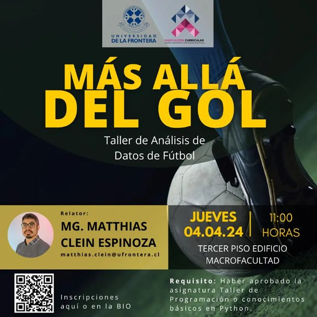

# "Más Allá del Gol": Taller de Análisis de Datos de Fútbol

Relator: Mg. Matthias Clein E.
 
Fecha: 04 de abril de 2024
 
Primer taller extracurricular impartido por la Línea Integradora de Formación en Ingeniería y Ciencias (LIFIC) de la Universidad de La Frontera, Temuco, Chile.
 
En el taller se hablará sobre datos de fútbol, sus diferentes tipos, la importancia de su contexto, proveedores de datos y comunicación de resultados. Todo esto se complementará con ejercicios prácticos en Google Colab para trabajar con Jupyter Notebooks programando en Python, utilizando diversas bibliotecas como: pandas, statsbombpy, matplotlib y mplsoccer y accediendo a datos gratuitos de Statsbomb.
